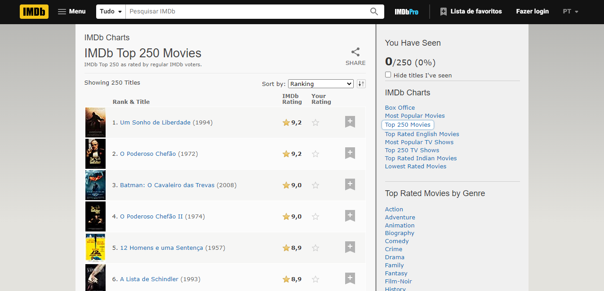
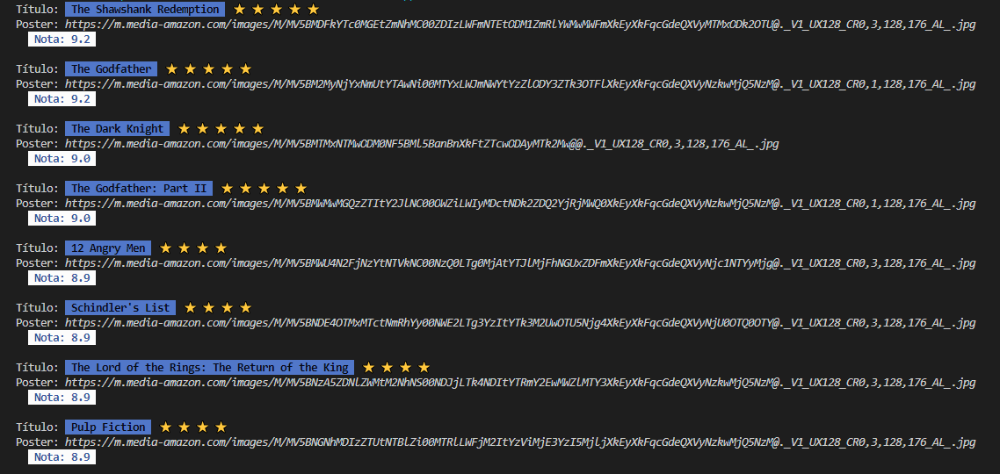

# Projeto Alura Stickers

  

<h4 align="center">🚧 <strong>Projeto em Desenvolvimento</strong> 🚀</h4>

## 📋 Sobre o Projeto

O projeto está sendo desenvolvido durante a Imersão Java da Alura com o objetivo de construir uma aplicação do zero para consumir a API do IMDb e exibir os filmes mais bem avaliados, destacando seus pôsteres e visualizando sua classificação, sem utilizar nenhuma biblioteca externa. Os dados extraídos serão manipulados a fim de gerar stickers que poderão ser compartilhados nas redes sociais.

## 💻 Demonstração

No atual estágio de desenvolvimento, a aplicação é capaz de fazer a conexão HTTP e buscar os filmes classificados, extrair e exibir os dados necessários.

## ✏️ Autor

| [ Luccas de Medeiros Gloria](https://github.com/luccasmg) |
| :---: |

## ✅ Licença

<a href="LICENSE.txt">MIT License</a>